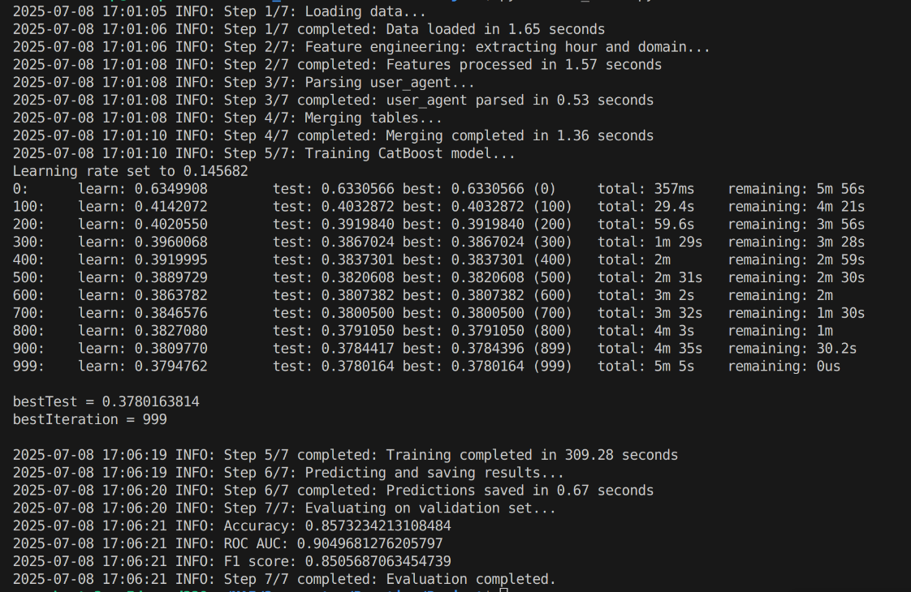

# Gender-prediction

Проект с платформы VK Education Practice: **"Предсказание пола пользователей соцсетей"**

## Описание

Данный проект посвящён задаче бинарной классификации — определению пола пользователя на основе его онлайн-активности, технических и поведенческих данных. Работа выполнена в рамках образовательной программы VK Education Practice.

## Используемые данные

- **train.csv** — обучающая выборка с пользовательскими сессиями
- **train_labels.csv** — метки пола для обучающей выборки
- **test.csv** — тестовая выборка
- **test_users.csv** — идентификаторы пользователей тестовой выборки
- **geo_info.csv** — географическая информация
- **referer_vectors.csv** — эмбеддинги рефереров (источников перехода)
- **Датасет и дополнительные материалы размещены на платформе All cups (необходима предварительная регистрация).** Ссылка на задачу и датасет: https://cups.online/ru/tasks/1923

## Краткое описание решения

1. **Загрузка и объединение данных**  
   Все необходимые датасеты подгружаются и объединяются по ключевым признакам (`user_id`, `geo_id`, `referer`).

2. **Feature Engineering**  
   - Выделяются новые признаки: час запроса, домен, браузер, ОС.
   - Парсинг поля user_agent.
   - Заполнение пропусков в region_id.
   - Использование эмбеддингов рефереров.

3. **Обработка категориальных признаков**  
   Признаки, такие как час запроса, домен, браузер, ОС, страна и регион, обрабатываются как категориальные.

4. **Модель**  
   Для решения задачи используется CatBoostClassifier с автоматическим подбором веса классов и ранней остановкой.

5. **Оценка**  
   Модель оценивается по метрикам Accuracy, ROC-AUC и F1-score.

6. **Генерация предсказаний**  
   Предсказания по тестовой выборке сохраняются в файл `pred_test_users.csv`.

## Быстрый старт

1. **Установите зависимости:**
    ```bash
    pip install -r requirements.txt
    ```

2. **Скачайте все необходимые датасеты и разместите их по пути:**
    ```
    data/data_from_allcups/
    ```

3. **Запустите обучение и генерацию предсказаний:**
    ```bash
    python ML_model.py
    ```

4. **Результаты появятся в `data/data_from_allcups/pred_test_users.csv`.**

## Структура репозитория

- `ML_model.py` — основной скрипт обработки данных, обучения и инференса модели
- `requirements.txt` — зависимости проекта
- `data/data_from_allcups/` — директория с исходными и промежуточными файлами данных (не хранится в репозитории)
- `images/` — изображения и демонстрационные материалы

## Визуализация



## Зависимости

- pandas
- catboost
- scikit-learn